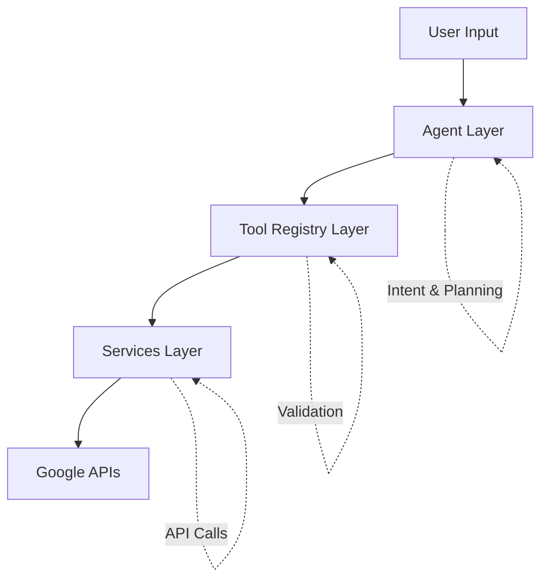

AgenticPal is built on a clean three-layer architecture that separates concerns and makes the system maintainable and extensible.

## Three-Layer Design

The architecture follows a clear separation of responsibilities:



### 1. Agent Layer

The Agent Layer handles high-level orchestration using an LLM for:

- **Intent parsing**: Understanding what the user wants
- **Action planning**: Determining which tools to use
- **Conversation management**: Handling multi-turn dialogues
- **Response synthesis**: Creating natural language responses

Located in `agent/graph/`, this layer uses LangGraph to manage the conversation flow through a state machine.

<CodeGroup>

```python agent/graph/graph_builder.py
"""Build the complete agent graph."""
from langgraph.graph import StateGraph, END
from langgraph.checkpoint.memory import MemorySaver

def build_agent_graph(tools_registry, llm, checkpointer=None):
    graph = StateGraph(AgentState)
    
    # Add nodes
    graph.add_node("plan_actions", partial(plan_actions, meta_tools=meta_tools, llm=llm))
    graph.add_node("route_execution", route_execution)
    graph.add_node("execute_parallel", partial(execute_tools_parallel, tool_executor=tools_registry.execute_tool))
    graph.add_node("execute_sequential", partial(execute_tools_sequential, tool_executor=tools_registry.execute_tool))
    graph.add_node("confirm_actions", confirm_actions)
    graph.add_node("synthesize_response", partial(synthesize_response, llm=llm))
    
    # Set entry point
    graph.set_entry_point("plan_actions")
    
    # Compile with checkpointer
    if checkpointer is None:
        checkpointer = MemorySaver()
    
    return graph.compile(
        checkpointer=checkpointer,
        interrupt_before=["confirm_actions"],
    )
```

</CodeGroup>

### 2. Tool Registry Layer

The Tool Registry Layer provides Pydantic-based validation and standardized tool execution:

- **Tool registration**: Central registry of all available tools
- **Parameter validation**: Pydantic models ensure type safety
- **Execution wrapper**: Standardized interface for tool invocation
- **Error handling**: Consistent error responses

Located in `agent/tools/`, this layer acts as a bridge between the agent and services.

<CodeGroup>

```python agent/tools/registry.py
class AgentTools:
    """Collection of tool wrapper functions for the agent."""
    
    def __init__(self, calendar_service, gmail_service, tasks_service, default_timezone="UTC"):
        self.calendar = calendar_service
        self.gmail = gmail_service
        self.tasks = tasks_service
        self.default_timezone = default_timezone
        
        # Build tool registry from definitions
        self._tool_registry = self._build_tool_registry()
    
    def execute_tool(self, name: str, arguments: dict) -> dict:
        """Execute a tool by name with given arguments."""
        tool = self._tool_registry.get(name)
        if not tool:
            return {
                "success": False,
                "message": f"Unknown tool: {name}",
                "error": f"Tool '{name}' not found in registry",
            }
        
        try:
            # Validate arguments with Pydantic model
            model = tool["model"]
            validated_params = model(**arguments)
            
            # Execute the function
            func = tool["function"]
            result = func(**validated_params.model_dump())
            return result
            
        except Exception as e:
            return {
                "success": False,
                "message": f"Error executing {name}: {str(e)}",
                "error": str(e),
            }
```

</CodeGroup>

### 3. Services Layer

The Services Layer handles direct Google API integration:

- **CalendarService**: Google Calendar CRUD operations
- **GmailService**: Email reading and searching
- **TasksService**: Google Tasks management

Located in `services/`, each service class wraps the Google API client library with a clean interface.

<Tip>
The services layer is designed to be replaceable - you could swap Google services for Microsoft 365, Notion, or any other productivity platform without changing the agent or tool registry layers.
</Tip>

## Data Flow

A typical request flows through all three layers:

<Steps>
  <Step title="User Request">
    User: "Add a meeting with John tomorrow at 2pm"
  </Step>
  
  <Step title="Agent Layer Processing">
    The LLM parses the intent and discovers the `add_calendar_event` tool using meta-tools
  </Step>
  
  <Step title="Tool Registry Validation">
    Parameters are validated against the Pydantic schema:
    ```python
    {
      "title": "Meeting with John",
      "start_time": "tomorrow 2pm",
      "timezone": "UTC"
    }
    ```
  </Step>
  
  <Step title="Service Execution">
    CalendarService calls the Google Calendar API to create the event
  </Step>
  
  <Step title="Response Synthesis">
    Agent synthesizes a natural language response: "I've added a meeting with John for tomorrow at 2:00 PM"
  </Step>
</Steps>

## Key Design Principles

<CardGroup cols={2}>
  <Card title="Separation of Concerns" icon="layer-group">
    Each layer has a single, well-defined responsibility
  </Card>
  
  <Card title="Type Safety" icon="shield-check">
    Pydantic models ensure runtime type validation
  </Card>
  
  <Card title="Extensibility" icon="puzzle-piece">
    Adding new tools or services follows a clear pattern
  </Card>
  
  <Card title="Testability" icon="flask">
    Each layer can be tested independently
  </Card>
</CardGroup>

## Adding New Capabilities

To add support for a new service (e.g., Notion):

1. **Services Layer**: Create `NotionService` class
2. **Tool Registry**: Add wrapper methods to `AgentTools`
3. **Tool Definitions**: Register tools in `tool_definitions.py`
4. **Schemas**: Define Pydantic models in `schemas.py`

The agent layer requires no changes - it automatically discovers and uses new tools through the meta-tools pattern.

<CodeGroup>

```python services/notion_service.py
class NotionService:
    """Notion API integration."""
    
    def create_page(self, database_id: str, properties: dict) -> dict:
        """Create a new page in a Notion database."""
        # Implementation
        pass
```

```python agent/tools/registry.py
class AgentTools:
    def __init__(self, ..., notion_service):
        # ...
        self.notion = notion_service
    
    def create_notion_page(self, database_id: str, title: str, content: str) -> dict:
        """Create a page in Notion."""
        return self.notion.create_page(
            database_id=database_id,
            properties={"title": title, "content": content}
        )
```

```python agent/tools/tool_definitions.py
TOOL_DEFINITIONS["create_notion_page"] = ToolDefinition(
    name="create_notion_page",
    summary="Create a new page in a Notion database",
    description="Create a new page in Notion with title and content",
    category="notion",
    actions=["create", "write"],
    is_write=True,
    schema=schemas.CreateNotionPageParams,
)
```

</CodeGroup>

## Next Steps

<CardGroup cols={2}>
  <Card title="Graph Reasoning" icon="diagram-project" href="/concepts/graph-reasoning">
    Learn how the LangGraph state machine orchestrates agent behavior
  </Card>
  
  <Card title="Tools System" icon="wrench" href="/concepts/tools-system">
    Deep dive into tool registration, validation, and meta-tools
  </Card>
</CardGroup>