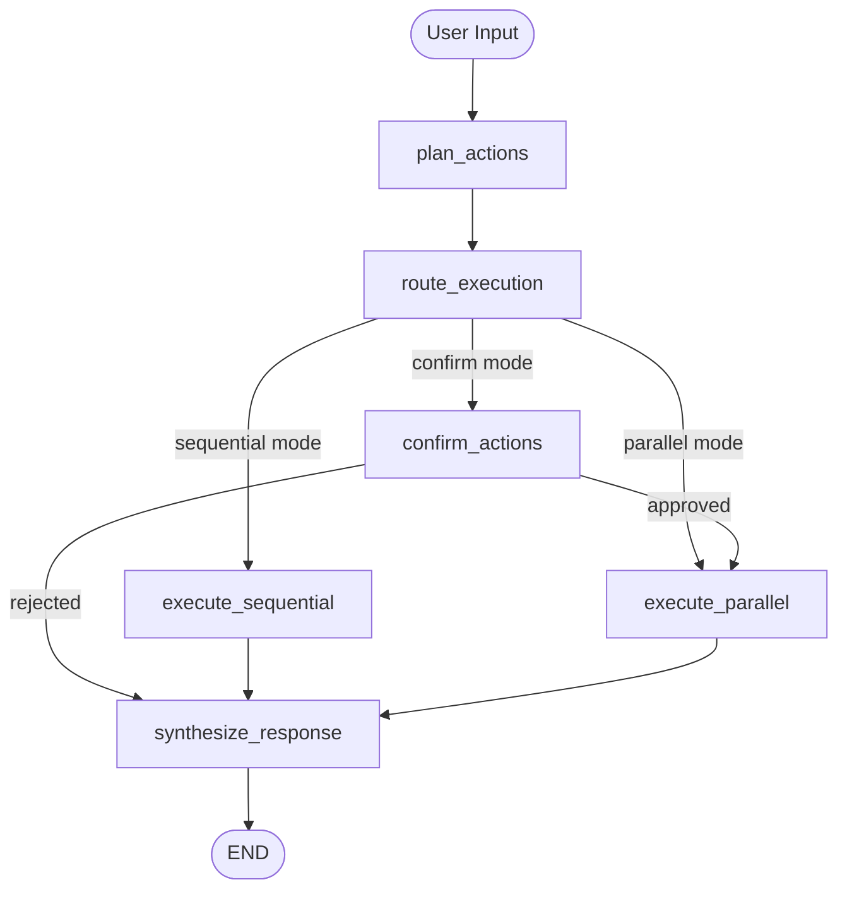

AgenticPal uses LangGraph to implement a stateful agent that can plan actions, request confirmations, and synthesize responses through a directed graph of nodes and edges.

## LangGraph Overview

LangGraph is a framework for building stateful, multi-actor applications with LLMs. It represents agent logic as a graph where:

- **Nodes** are processing steps (e.g., plan actions, execute tools)
- **Edges** define the flow between nodes
- **State** is a typed dictionary that flows through the graph

## Agent State

The agent maintains a typed state that carries information through the graph:

<CodeGroup>

```python agent/graph/state.py
class AgentState(TypedDict, total=False):
    """State that flows through the agent graph."""
    
    # Input (required)
    user_message: str
    conversation_history: List[Dict[str, Any]]
    
    # Planning
    actions: List[Dict[str, Any]]
    requires_confirmation: bool
    
    # Execution
    execution_mode: Literal["parallel", "sequential", "confirm"]
    results: Dict[str, Any]
    
    # Confirmation
    pending_confirmation: Optional[Dict[str, Any]]
    user_confirmation: Optional[str]
    confirmation_message: Optional[str]
    
    # Output
    final_response: Optional[str]
    
    # Session
    session_id: str
    session_context: Dict[str, Any]
    
    # Tool Discovery (meta-tools)
    discovered_tools: List[str]
    tool_invocations: List[Dict[str, Any]]
    
    # Error Handling
    error: Optional[str]
```

</CodeGroup>

<Info>
Using `TypedDict` instead of Pydantic models allows dictionary-style access (`state["key"]`) which is required by LangGraph, while still providing type hints for IDE support.
</Info>

## Graph Structure

The agent graph has the following nodes and edges:



### Graph Nodes

<AccordionGroup>
  <Accordion title="plan_actions" icon="lightbulb">
    Plans which tools to execute based on user input.
    
    **Input**: `user_message`, `conversation_history`
    
    **Output**: `actions`, `requires_confirmation`, `discovered_tools`
    
    This node uses meta-tools (discover, schema, invoke) to find and use the right tools without loading all tool schemas upfront. The LLM iteratively discovers tools, checks their schemas, and invokes them.
    
    ```python agent/graph/nodes/plan_actions.py
    def plan_actions(state: AgentState, meta_tools, llm) -> AgentState:
        """Plan actions to fulfill user request."""
        user_message = state["user_message"]
        
        # Get meta-tools for LLM binding
        tools = meta_tools.get_langchain_tools()
        llm_with_tools = llm.bind_tools(tools)
        
        # Agent loop - let LLM use meta-tools
        for iteration in range(max_iterations):
            response = llm_with_tools.invoke(messages)
            tool_calls = _parse_tool_calls_from_response(response)
            
            if not tool_calls:
                break  # LLM is done
            
            # Execute tool calls and add results to messages
            for tc in tool_calls:
                if tc["name"] == "invoke_tool":
                    invoked_tool = tc["args"]["tool_name"]
                    if invoked_tool in DESTRUCTIVE_TOOLS:
                        requires_confirmation = True
                    else:
                        result = meta_tools.invoke_tool(...)
                        results[action_id] = result
        
        return {**state, "actions": actions, "results": results, "requires_confirmation": requires_confirmation}
    ```
  </Accordion>
  
  <Accordion title="route_execution" icon="turn-down">
    Determines how to execute the planned actions.
    
    **Input**: `actions`, `requires_confirmation`
    
    **Output**: `execution_mode`
    
    Sets `execution_mode` to:
    - `"confirm"` if destructive operations need approval
    - `"sequential"` if actions have dependencies
    - `"parallel"` for independent actions
  </Accordion>
  
  <Accordion title="confirm_actions" icon="circle-question">
    Requests user confirmation for destructive operations.
    
    **Input**: `actions`
    
    **Output**: `confirmation_message`, `pending_confirmation`
    
    This node is configured as an interrupt point - the graph pauses here and waits for user input before continuing.
    
    ```python agent/graph/graph_builder.py
    compiled_graph = graph.compile(
        checkpointer=checkpointer,
        interrupt_before=["confirm_actions"],  # Pause for human input
    )
    ```
  </Accordion>
  
  <Accordion title="execute_parallel" icon="bars-staggered">
    Executes independent actions in parallel using ThreadPoolExecutor.
    
    **Input**: `actions`
    
    **Output**: `results`
    
    ```python agent/graph/nodes/execute_tools.py
    def execute_tools_parallel(state: AgentState, tool_executor) -> AgentState:
        """Execute all actions in parallel."""
        actions = state.get("actions", [])
        results = state.get("results", {}).copy()
        
        # Execute tools in parallel using ThreadPoolExecutor
        with concurrent.futures.ThreadPoolExecutor(max_workers=5) as executor:
            futures = {}
            for action in actions:
                future = executor.submit(tool_executor, action["tool"], action["args"])
                futures[action["id"]] = future
            
            # Collect results
            for action_id, future in futures.items():
                results[action_id] = future.result(timeout=30)
        
        return {**state, "results": results}
    ```
  </Accordion>
  
  <Accordion title="execute_sequential" icon="arrow-down-1-9">
    Executes actions sequentially, respecting dependencies.
    
    **Input**: `actions`
    
    **Output**: `results`
    
    Uses topological sort to order actions by their `depends_on` relationships. Results from earlier actions can be injected into later actions.
    
    ```python agent/graph/nodes/execute_tools.py
    def execute_tools_sequential(state: AgentState, tool_executor) -> AgentState:
        """Execute actions sequentially respecting dependencies."""
        actions = state.get("actions", [])
        results = state.get("results", {}).copy()
        
        # Sort actions by dependencies
        sorted_actions = _topological_sort(actions)
        
        # Execute in order
        for action in sorted_actions:
            # Inject results from dependencies
            resolved_action = _inject_dependencies(action, results)
            result = tool_executor(resolved_action["tool"], resolved_action["args"])
            results[action["id"]] = result
        
        return {**state, "results": results}
    ```
  </Accordion>
  
  <Accordion title="synthesize_response" icon="message">
    Creates a natural language response for the user.
    
    **Input**: `actions`, `results`, `user_message`
    
    **Output**: `final_response`
    
    The LLM synthesizes the tool results into a conversational response that answers the user's original question.
  </Accordion>
</AccordionGroup>

## Graph Edges

Edges define transitions between nodes:

<CodeGroup>

```python agent/graph/graph_builder.py
# Entry point
graph.set_entry_point("plan_actions")

# Linear edge
graph.add_edge("plan_actions", "route_execution")

# Conditional routing after route_execution
def _route_after_execution(state: AgentState):
    mode = state.get("execution_mode", "parallel")
    if mode == "confirm":
        return "confirm_actions"
    elif mode == "sequential":
        return "execute_sequential"
    else:
        return "execute_parallel"

graph.add_conditional_edges(
    "route_execution",
    _route_after_execution,
    {
        "execute_parallel": "execute_parallel",
        "execute_sequential": "execute_sequential",
        "confirm_actions": "confirm_actions",
    }
)

# Execution paths converge to synthesis
graph.add_edge("execute_parallel", "synthesize_response")
graph.add_edge("execute_sequential", "synthesize_response")

# End
graph.add_edge("synthesize_response", END)
```

</CodeGroup>

## Checkpointing and Persistence

The graph uses a checkpointer to save state between interactions:

```python
from langgraph.checkpoint.memory import MemorySaver

checkpointer = MemorySaver()
compiled_graph = graph.compile(checkpointer=checkpointer)
```

This enables:
- **Multi-turn conversations**: State persists across messages
- **Human-in-the-loop**: Graph can pause at interrupt points
- **Error recovery**: State can be rolled back if needed

<Tip>
For production use, replace `MemorySaver` with a persistent checkpointer like `SqliteSaver` or `PostgresSaver` to maintain conversations across restarts.
</Tip>

## Example Execution Flow

Let's trace a request through the graph:

<Steps>
  <Step title="User Input">
    User: "Delete my meeting with John"
    
    State: `{user_message: "Delete my meeting with John", ...}`
  </Step>
  
  <Step title="plan_actions Node">
    LLM uses meta-tools:
    1. `discover_tools(categories=["calendar"], actions=["delete"])` → finds `delete_calendar_event`
    2. `discover_tools(categories=["calendar"], actions=["search"])` → finds `search_calendar_events`
    3. `invoke_tool("search_calendar_events", {"query": "John"})` → finds event ID
    4. Marks `delete_calendar_event` for confirmation
    
    State: `{actions: [{tool: "delete_calendar_event", args: {event_id: "123"}}], requires_confirmation: true, ...}`
  </Step>
  
  <Step title="route_execution Node">
    Checks `requires_confirmation` and sets `execution_mode` to `"confirm"`
    
    State: `{execution_mode: "confirm", ...}`
  </Step>
  
  <Step title="confirm_actions Node (Interrupt)">
    Graph pauses and returns to user:
    
    "This will delete the calendar event: 'Meeting with John' on Tuesday at 2:00 PM. Confirm? (yes/no)"
  </Step>
  
  <Step title="User Confirms">
    User: "yes"
    
    Graph resumes from checkpoint
  </Step>
  
  <Step title="execute_parallel Node">
    Executes the delete operation:
    
    State: `{results: {a1: {success: true, message: "Event deleted"}}, ...}`
  </Step>
  
  <Step title="synthesize_response Node">
    LLM creates response:
    
    "I've deleted your meeting with John that was scheduled for Tuesday at 2:00 PM."
    
    State: `{final_response: "I've deleted...", ...}`
  </Step>
</Steps>

## Meta-Tools Pattern

The graph uses a "meta-tools" pattern to reduce token usage by 96%:

Instead of loading all 15+ tool schemas (≈6000 tokens), the agent has access to just 3 meta-tools (≈550 tokens):

1. **discover_tools**: Find tools by category/action
2. **get_tool_schema**: Get full schema for a specific tool
3. **invoke_tool**: Execute a tool with parameters

The LLM iteratively uses these meta-tools to find and execute the right tools for each request.

<Card title="Learn More" icon="book" href="/concepts/tools-system">
See the Tools System page for details on meta-tools implementation
</Card>

## Next Steps

<CardGroup cols={2}>
  <Card title="Tools System" icon="wrench" href="/concepts/tools-system">
    Learn how tools are registered, validated, and executed
  </Card>
  
  <Card title="Agent Flow" icon="diagram-project" href="/concepts/agent-flow">
    See complete examples of agent execution flows
  </Card>
</CardGroup>