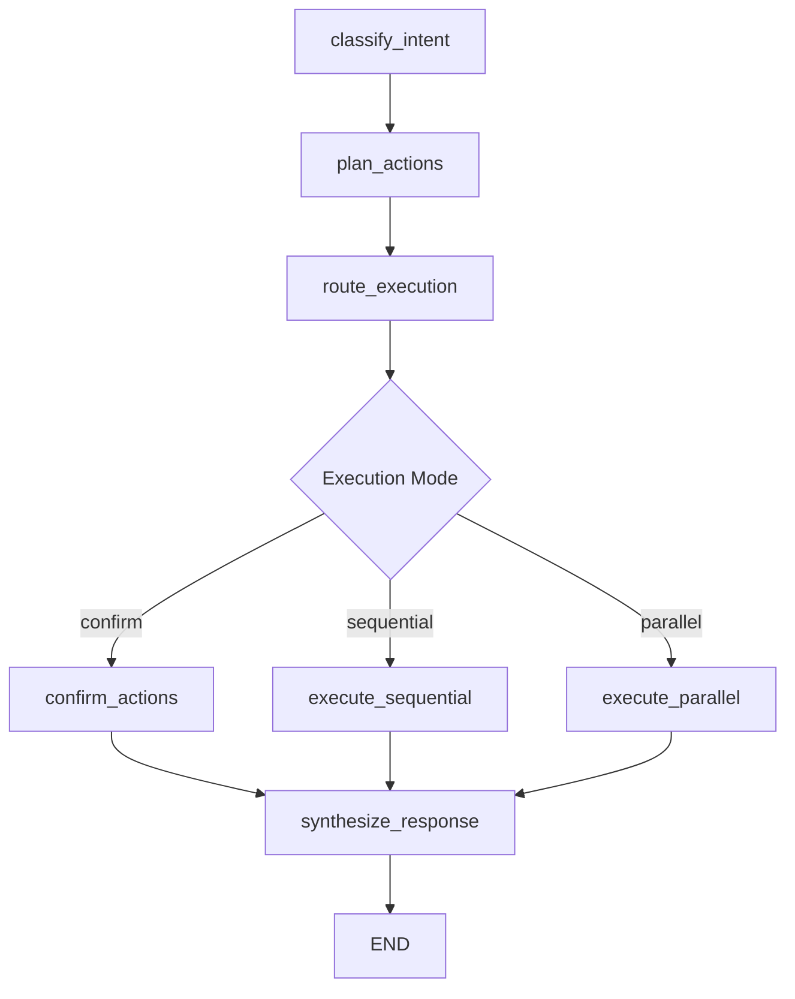

AgenticPal uses a graph-based execution model where each node performs a specific function. Understanding this architecture allows you to extend the agent's behavior.

## Graph Architecture

The execution flow follows this graph:



Each node receives and returns an `AgentState` dict containing:
- `user_message` - Current user input
- `conversation_history` - Previous messages
- `actions` - Planned tool invocations
- `results` - Tool execution results
- `final_response` - Generated response for user

## Core Nodes

### plan_actions

**Purpose:** Plans which tools to execute based on user request

**Location:** `agent/graph/nodes/plan_actions.py`

**Key features:**
- Uses meta-tools (discover_tools, get_tool_schema, invoke_tool)
- Supports both DSPy and legacy LangChain modes
- Handles multi-step tool calling
- Identifies destructive operations

```python agent/graph/nodes/plan_actions.py
def plan_actions(state: AgentState, meta_tools, llm) -> AgentState:
    """
    Plan actions to fulfill user request.
    
    Routes to either DSPy or legacy implementation based on PromptConfig.
    """
    if PromptConfig.is_dspy():
        return _plan_actions_dspy(state, meta_tools, llm)
    else:
        return _plan_actions_legacy(state, meta_tools, llm)
```

**Outputs:**
- `actions` - List of tool invocations with IDs and dependencies
- `results` - Results from tools executed during planning
- `requires_confirmation` - Whether user confirmation is needed
- `discovered_tools` - Tools found via discovery

### route_execution

**Purpose:** Determines execution strategy based on action dependencies

**Location:** `agent/graph/nodes/route_execution.py`

```python agent/graph/nodes/route_execution.py
def route_execution(state: AgentState) -> AgentState:
    """
    Determine execution mode based on action dependencies.
    
    Logic:
    - If requires_confirmation → "confirm"
    - If any action has depends_on → "sequential"
    - Otherwise → "parallel"
    """
    actions = state.get("actions", [])
    requires_confirmation = state.get("requires_confirmation", False)
    
    if requires_confirmation:
        execution_mode = "confirm"
    elif any(action.get("depends_on") for action in actions):
        execution_mode = "sequential"
    else:
        execution_mode = "parallel"
    
    return {**state, "execution_mode": execution_mode}
```

### confirm_actions

**Purpose:** Handles human-in-the-loop confirmation for destructive operations

**Location:** `agent/graph/nodes/confirm_actions.py`

```python agent/graph/nodes/confirm_actions.py
DESTRUCTIVE_TOOLS = {
    "delete_calendar_event": "calendar event",
    "delete_task": "task",
}

def confirm_actions(state: AgentState) -> AgentState:
    """
    Prepare confirmation state for destructive actions.
    
    Builds confirmation message and pauses for user input.
    """
    actions = state.get("actions", [])
    
    destructive_actions = [
        a for a in actions 
        if a.get("tool") in DESTRUCTIVE_TOOLS
    ]
    
    if not destructive_actions:
        return {
            **state,
            "requires_confirmation": False,
            "pending_confirmation": None,
        }
    
    confirmation_message = _build_confirmation_message(actions)
    
    return {
        **state,
        "pending_confirmation": destructive_actions,
        "confirmation_message": confirmation_message,
    }
```

### execute_tools_parallel

**Purpose:** Executes independent actions concurrently

**Location:** `agent/graph/nodes/execute_tools.py`

```python agent/graph/nodes/execute_tools.py
def execute_tools_parallel(state: AgentState, tool_executor) -> AgentState:
    """
    Execute all actions in parallel using ThreadPoolExecutor.
    
    Used when actions are independent (no depends_on).
    """
    actions = state.get("actions", [])
    results = state.get("results", {}).copy()
    
    # Filter out already-executed actions
    actions_to_execute = [a for a in actions if a["id"] not in results]
    
    with concurrent.futures.ThreadPoolExecutor(max_workers=5) as executor:
        futures = {}
        
        for action in actions_to_execute:
            future = executor.submit(
                tool_executor,
                action["tool"],
                action.get("args", {})
            )
            futures[action["id"]] = future
        
        # Collect results
        for action_id, future in futures.items():
            try:
                results[action_id] = future.result(timeout=30)
            except Exception as e:
                results[action_id] = {
                    "success": False,
                    "error": str(e),
                }
    
    return {**state, "results": results}
```

### execute_tools_sequential

**Purpose:** Executes actions respecting dependencies via topological sort

**Location:** `agent/graph/nodes/execute_tools.py`

```python agent/graph/nodes/execute_tools.py
def execute_tools_sequential(state: AgentState, tool_executor) -> AgentState:
    """
    Execute actions sequentially respecting dependencies.
    
    Uses topological sort to ensure dependencies run first.
    """
    actions = state.get("actions", [])
    results = state.get("results", {}).copy()
    
    # Sort actions by dependencies
    sorted_actions = _topological_sort(actions)
    
    for action in sorted_actions:
        if action["id"] in results:
            continue  # Already executed
            
        # Inject results from dependencies
        resolved_action = _inject_dependencies(action, results)
        
        try:
            result = tool_executor(
                resolved_action["tool"],
                resolved_action.get("args", {})
            )
            results[action["id"]] = result
        except Exception as e:
            results[action["id"]] = {
                "success": False,
                "error": str(e),
            }
    
    return {**state, "results": results}
```

### synthesize_response

**Purpose:** Converts tool results into natural language response

**Location:** `agent/graph/nodes/synthesize_response.py`

```python agent/graph/nodes/synthesize_response.py
def synthesize_response(state: AgentState, llm) -> AgentState:
    """
    Synthesize final response from tool results.
    
    This is LLM Call #2 - the response formatting call.
    """
    if PromptConfig.is_dspy():
        return _synthesize_response_dspy(state, llm)
    else:
        return _synthesize_response_legacy(state, llm)
```

## Creating Custom Nodes

<Steps>
  <Step title="Define Node Function">
    Create a new file in `agent/graph/nodes/`:

    ```python agent/graph/nodes/validate_input.py
    from ..state import AgentState

    def validate_input(state: AgentState) -> AgentState:
        """
        Validate user input before processing.
        
        Checks for:
        - Empty messages
        - Malformed requests
        - Unsafe content
        """
        user_message = state.get("user_message", "")
        
        if not user_message.strip():
            return {
                **state,
                "error": "Empty message",
                "final_response": "Please provide a request.",
            }
        
        if len(user_message) > 5000:
            return {
                **state,
                "error": "Message too long",
                "final_response": "Please keep requests under 5000 characters.",
            }
        
        # Passed validation
        return state
    ```
  </Step>

  <Step title="Register in Graph">
    Update the graph construction to include your node:

    ```python agent/graph/builder.py
    from .nodes.validate_input import validate_input

    def build_graph(llm, tools, meta_tools):
        graph = StateGraph(AgentState)
        
        # Add your node
        graph.add_node("validate_input", validate_input)
        graph.add_node("plan_actions", lambda s: plan_actions(s, meta_tools, llm))
        # ... other nodes ...
        
        # Add edges
        graph.set_entry_point("validate_input")
        graph.add_edge("validate_input", "plan_actions")
        # ... other edges ...
        
        return graph.compile()
    ```
  </Step>

  <Step title="Add Conditional Routing (Optional)">
    For conditional logic, use `add_conditional_edges`:

    ```python
    def should_proceed(state: AgentState) -> str:
        """Route based on validation result."""
        if state.get("error"):
            return "synthesize_response"  # Skip to response
        return "plan_actions"  # Continue normally

    graph.add_conditional_edges(
        "validate_input",
        should_proceed,
        {
            "synthesize_response": "synthesize_response",
            "plan_actions": "plan_actions",
        }
    )
    ```
  </Step>
</Steps>

## Node Best Practices

<CardGroup cols={2}>
  <Card title="Pure Functions" icon="function">
    Nodes should be pure functions that don't modify state in place. Always return a new state dict.
  </Card>
  
  <Card title="Error Handling" icon="shield-exclamation">
    Wrap risky operations in try-except and set the `error` key in state for downstream handling.
  </Card>
  
  <Card title="State Minimization" icon="compress">
    Only add necessary keys to state. Avoid storing large objects that don't need to flow through the graph.
  </Card>
  
  <Card title="Logging" icon="file-lines">
    Add logging for debugging but avoid excessive output in production.
  </Card>
</CardGroup>

## Dependency Injection Pattern

Nodes that need external dependencies (LLM, services) receive them via closures:

```python
def build_graph(llm, tools, meta_tools):
    # Nodes that need dependencies
    def plan_with_context(state):
        return plan_actions(state, meta_tools, llm)
    
    def execute_with_context(state):
        return execute_tools_parallel(state, tools.execute_tool)
    
    graph.add_node("plan_actions", plan_with_context)
    graph.add_node("execute_parallel", execute_with_context)
```

This keeps node signatures clean while providing necessary context.

## See Also

<CardGroup cols={2}>
  <Card title="Custom Tools" icon="wrench" href="/development/custom-tools">
    Add new tools that your nodes can invoke
  </Card>
  
  <Card title="Testing" icon="flask" href="/development/testing">
    Learn how to test custom nodes
  </Card>
</CardGroup>