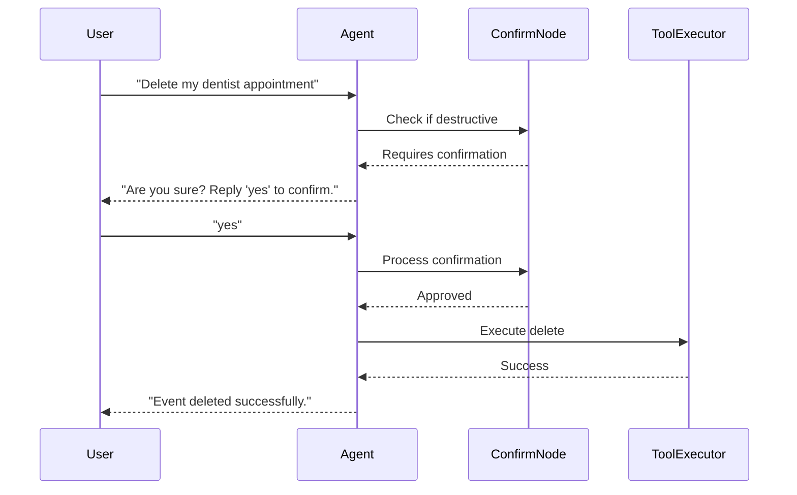

AgenticPal implements confirmation flows to prevent accidental data loss. Destructive operations require explicit user approval before execution.

## Destructive Operations

Two types of operations require confirmation:

### 1. Delete Calendar Event
```python
"delete_calendar_event"
```
Permanently removes events from your Google Calendar.

### 2. Delete Task
```python
"delete_task"
```
Permanently removes tasks from your Google Tasks list.

<Note>
Other operations (create, update, list, read) execute immediately without confirmation since they don't result in data loss.
</Note>

## How Confirmations Work

The confirmation flow follows these steps:



### Implementation

From `agent/graph/nodes/confirm_actions.py`:

```python
# Destructive tools that require confirmation
DESTRUCTIVE_TOOLS = {
    "delete_calendar_event": "calendar event",
    "delete_task": "task",
}

def confirm_actions(state: AgentState) -> AgentState:
    """Prepare confirmation state for destructive actions."""
    actions = state.get("actions", [])
    
    # Find destructive actions
    destructive_actions = [
        a for a in actions 
        if a.get("tool") in DESTRUCTIVE_TOOLS
    ]
    
    if not destructive_actions:
        return {
            **state,
            "requires_confirmation": False,
        }
    
    # Build confirmation message
    confirmation_message = _build_confirmation_message(actions)
    
    return {
        **state,
        "pending_confirmation": destructive_actions,
        "confirmation_message": confirmation_message,
    }
```

## Confirmation Messages

The system generates clear, informative confirmation prompts:

### Single Deletion
```python
User: "Delete my dentist appointment"
Agent: "**Confirmation Required**

The following actions will modify or delete data:
- Delete calendar event (ID: evt_abc123)

Reply **yes** to confirm, **no** to cancel, or **edit** to modify."
```

### Multiple Deletions
```python
User: "Delete all my tasks"
Agent: "**Confirmation Required**

The following actions will modify or delete data:
- Delete task (ID: task_123)
- Delete task (ID: task_456)
- Delete task (ID: task_789)

Reply **yes** to confirm, **no** to cancel, or **edit** to modify."
```

### Message Format

From `agent/graph/nodes/confirm_actions.py`:

```python
def _build_confirmation_message(actions: List[dict]) -> str:
    """Build a human-readable confirmation message."""
    destructive_actions = [
        a for a in actions 
        if a.get("tool") in DESTRUCTIVE_TOOLS
    ]
    
    if not destructive_actions:
        return None
    
    lines = ["**Confirmation Required**\n"]
    lines.append("The following actions will modify or delete data:\n")
    
    for action in destructive_actions:
        tool = action.get("tool", "")
        args = action.get("args", {})
        item_type = DESTRUCTIVE_TOOLS.get(tool, "item")
        
        if "event_id" in args:
            lines.append(f"- Delete {item_type} (ID: {args['event_id']})")
        elif "task_id" in args:
            lines.append(f"- Delete {item_type} (ID: {args['task_id']})")
        else:
            lines.append(f"- Delete {item_type}")
    
    lines.append("\nReply **yes** to confirm, **no** to cancel, or **edit** to modify.")
    
    return "\n".join(lines)
```

## User Responses

The system accepts multiple response formats:

### Confirmation (Proceed)

Accepted responses:
- `yes`
- `y`
- `confirm`
- `ok`
- `proceed`

```python
User: "yes"
Agent: [Executes deletion]
"Event deleted successfully."
```

### Cancellation (Abort)

Accepted responses:
- `no`
- `n`
- `cancel`
- `abort`

```python
User: "no"
Agent: "Operation cancelled."
```

### Modification (Edit)

Accepted response:
- `edit`

```python
User: "edit"
Agent: "Please specify what you'd like to change."

User: "Actually, just delete the first one"
Agent: [Processes modified request]
```

### Unclear Response

If the response is ambiguous:

```python
User: "maybe"
Agent: "Please reply **yes** to confirm or **no** to cancel."
```

## Processing Confirmations

From `agent/graph/nodes/confirm_actions.py`:

```python
def process_confirmation(state: AgentState) -> AgentState:
    """Process user's confirmation response."""
    user_confirmation = state.get("user_confirmation", "").lower().strip()
    actions = state.get("actions", [])
    
    if user_confirmation in ("yes", "y", "confirm", "ok", "proceed"):
        # User confirmed - allow all actions to proceed
        return {
            **state,
            "requires_confirmation": False,
            "pending_confirmation": None,
        }
    
    elif user_confirmation in ("no", "n", "cancel", "abort"):
        # User rejected - remove destructive actions
        non_destructive = [
            a for a in actions 
            if a.get("tool") not in DESTRUCTIVE_TOOLS
        ]
        return {
            **state,
            "actions": non_destructive,
            "requires_confirmation": False,
            "pending_confirmation": None,
            "confirmation_message": "Operation cancelled.",
        }
    
    elif user_confirmation == "edit":
        # User wants to modify - keep pending state
        return {
            **state,
            "confirmation_message": "Please specify what you'd like to change.",
        }
    
    else:
        # Unclear response - ask again
        return {
            **state,
            "confirmation_message": "Please reply **yes** to confirm or **no** to cancel.",
        }
```

## Execution Flow

### Confirming Before Execution

From `agent/graph/nodes/plan_actions.py`:

```python
# During action planning
if invoked_tool in DESTRUCTIVE_TOOLS:
    requires_confirmation = True
    actions.append({
        "id": f"a{len(actions)+1}",
        "tool": invoked_tool,
        "args": params,
        "depends_on": [],
        "pending_confirmation": True,  # Flag for confirmation
    })
else:
    # Non-destructive tools execute immediately
    result = meta_tools.invoke_tool(invoked_tool, params)
    actions.append({
        "id": f"a{len(actions)+1}",
        "tool": invoked_tool,
        "args": params,
        "depends_on": [],
    })
    results[action_id] = result
```

Destructive operations:
1. Are flagged with `pending_confirmation: True`
2. **Not executed** during planning
3. Routed to `confirm_actions` node
4. Executed only after user approval

### Routing Logic

The graph routes execution based on confirmation requirements:

```python
if state.get("requires_confirmation"):
    # Route to confirmation node
    next_node = "confirm_actions"
else:
    # Route to execution
    next_node = "execute_tools"
```

## Examples

### Simple Deletion

```python
User: "Delete my meeting on Friday"
Agent: [Searches for meeting, finds event_123]
"**Confirmation Required**

The following actions will modify or delete data:
- Delete calendar event (ID: event_123)

Reply **yes** to confirm, **no** to cancel, or **edit** to modify."

User: "yes"
Agent: [Executes delete_calendar_event(event_id="event_123")]
"Event deleted successfully."
```

### Cancelled Deletion

```python
User: "Delete the project task"
Agent: "**Confirmation Required**

The following actions will modify or delete data:
- Delete task (ID: task_456)

Reply **yes** to confirm, **no** to cancel, or **edit** to modify."

User: "no"
Agent: "Operation cancelled."
```

### Modified Request

```python
User: "Delete all my tasks"
Agent: [Finds 3 tasks]
"**Confirmation Required**

The following actions will modify or delete data:
- Delete task (ID: task_123)
- Delete task (ID: task_456)
- Delete task (ID: task_789)

Reply **yes** to confirm, **no** to cancel, or **edit** to modify."

User: "edit"
Agent: "Please specify what you'd like to change."

User: "Just delete the first task"
Agent: [Re-plans with single deletion]
"**Confirmation Required**

The following actions will modify or delete data:
- Delete task (ID: task_123)

Reply **yes** to confirm, **no** to cancel, or **edit** to modify."

User: "yes"
Agent: "Task deleted successfully."
```

### Mixed Operations

Non-destructive operations execute immediately, only destructive ones wait:

```python
User: "Show my calendar and delete the dentist appointment"
Agent: [Executes list_calendar_events immediately]
"You have 3 events today:
1. Team standup at 9am
2. Dentist appointment at 2pm
3. Project review at 4pm

**Confirmation Required**

The following actions will modify or delete data:
- Delete calendar event (ID: event_abc)

Reply **yes** to confirm, **no** to cancel, or **edit** to modify."

User: "yes"
Agent: "Event deleted successfully."
```

## Safety Features

### No Implicit Deletions

The system never deletes without explicit user intent:

```python
User: "I don't need the meeting anymore"
Agent: "Would you like me to delete the meeting? Please confirm."

User: "yes"
Agent: [Triggers confirmation flow]
```

### Clear Action Description

Confirmation messages describe what will be deleted:

```
- Delete calendar event (ID: event_123)
- Delete task (ID: task_456)
```

### Multiple Confirmation Levels

1. **Intent confirmation**: "Would you like me to delete...?"
2. **Action confirmation**: "Are you sure? Reply 'yes' to confirm."

This prevents accidental deletions from ambiguous language.

### Audit Trail

<Info>
Future versions will include:
- Deletion history/log
- Undo functionality
- Trash/archive instead of permanent deletion
</Info>

## Limitations

<Warning>
Current limitations:
- **No undo**: Once confirmed, deletions are permanent
- **No bulk confirmation**: Each deletion requires individual confirmation
- **No soft delete**: Items are permanently removed, not archived

Google Calendar and Tasks APIs don't support trash/archive, so deletions are immediate and irreversible.
</Warning>

## Best Practices

### For Users

**Review Confirmation Details**:
```python
✓ Check the event/task ID matches what you want to delete
✓ Verify the item description before confirming
✓ Use 'edit' if you changed your mind
```

**Be Explicit**:
```python
✓ "Delete my dentist appointment on Friday"
✗ "Remove it"  # Ambiguous without context
```

**Use Edit Option**:
```python
User: "Delete all my tasks"
Agent: [Shows 10 tasks to be deleted]
User: "edit"
Agent: "What would you like to change?"
User: "Only delete completed tasks"
```

### For Developers

**Add New Destructive Operations**:

To require confirmation for additional operations:

```python
# In agent/graph/nodes/plan_actions.py
DESTRUCTIVE_TOOLS = {
    "delete_calendar_event": "calendar event",
    "delete_task": "task",
    "send_email": "email",  # New destructive operation
}
```

**Custom Confirmation Messages**:

Extend `_build_confirmation_message()` for richer context:

```python
if "event_id" in args:
    event_title = get_event_title(args["event_id"])
    lines.append(f"- Delete calendar event '{event_title}' on {event_date}")
```

## Future Enhancements

<Info>
Planned improvements:
- **Undo support**: Recover recently deleted items
- **Soft delete**: Archive instead of permanent deletion
- **Batch confirmation**: Confirm multiple deletions at once
- **Confirmation timeout**: Auto-cancel if no response within X minutes
- **Deletion history**: View and restore deleted items
</Info>

## Next Steps

<CardGroup cols={2}>
  <Card title="Calendar" icon="calendar" href="/features/calendar">
    Learn about calendar event management
  </Card>
  <Card title="Tasks" icon="check-square" href="/features/tasks">
    Explore task management features
  </Card>
</CardGroup>