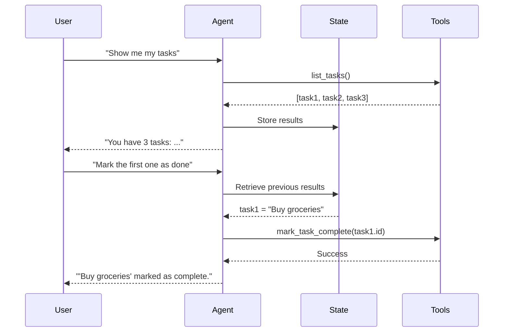

AgenticPal supports multi-turn conversations, maintaining context across interactions to handle complex requests and ask clarifying questions when needed.

## How It Works

The agent maintains conversation history and uses it to:
- Remember previous requests and results
- Resolve ambiguous references ("it", "that", "the meeting")
- Ask follow-up questions
- Provide contextual responses

### Conversation State

From `agent/graph/state.py` (AgentState):

```python
class AgentState(TypedDict):
    user_message: str                    # Current user input
    conversation_history: List[dict]     # Previous messages
    actions: List[dict]                  # Planned actions
    results: dict                        # Tool execution results
    final_response: str                  # Agent's response
    # ... other fields
```

Conversation history stores messages in this format:
```python
{
    "role": "user" | "assistant",
    "content": "message content",
    "timestamp": "2026-03-08T14:30:00Z"
}
```

### Context Window

The agent includes the last 5 messages when processing requests:

```python
# From agent/graph/nodes/plan_actions.py
for msg in conversation_history[-5:]:
    if msg.get("role") == "user":
        messages.append(HumanMessage(content=msg["content"]))
    elif msg.get("role") == "assistant":
        messages.append(AIMessage(content=msg["content"]))
```

This provides sufficient context without overwhelming the LLM.

## Multi-turn Patterns

### 1. Clarifying Questions

When information is missing, the agent asks for details:

```python
User: "Add a meeting with John"
Agent: "I'd be happy to schedule a meeting with John. When would you like to meet?"

User: "Tomorrow at 2pm"
Agent: "How long should the meeting be?"

User: "One hour"
Agent: "Meeting with John scheduled for March 9th, 2:00 PM - 3:00 PM."
```

**Why This Works**: The agent remembers:
- Attendee: John
- Date/time: Tomorrow at 2pm
- Duration: 1 hour

Each response builds on previous context.

### 2. Reference Resolution

The agent resolves pronouns and references:

```python
User: "Show me my calendar for today"
Agent: "You have 3 events today:
1. Team standup at 9am
2. Dentist appointment at 2pm
3. Project review at 4pm"

User: "Cancel the dentist appointment"
Agent: [Knows "the dentist appointment" refers to event #2]
"Are you sure you want to delete 'Dentist appointment' on March 8 at 2pm? Reply 'yes' to confirm."

User: "Yes"
Agent: "Event deleted successfully."
```

**Context Used**:
- "the dentist appointment" → Event from previous response
- "Yes" → Confirmation for pending deletion

### 3. Iterative Refinement

Users can refine requests across multiple turns:

```python
User: "Create a task to buy groceries"
Agent: "Task 'buy groceries' created successfully."

User: "Actually, make that due tomorrow"
Agent: [Updates most recently created task]
"Task updated with due date March 9, 2026."

User: "Add notes: milk, eggs, bread"
Agent: "Task notes updated."
```

**Context Tracking**:
- Remembers last created task ID
- "that" refers to the task
- Incremental updates without re-specifying task

### 4. Progressive Disclosure

Agent reveals information step-by-step:

```python
User: "Show me emails from Sarah"
Agent: "Found 5 emails from Sarah:
1. 'Project Update' (March 8)
2. 'Meeting Notes' (March 7)
3. 'Budget Review' (March 6)
..."

User: "Read the first one"
Agent: [Retrieves full content of email #1]
"Subject: Project Update
From: Sarah Johnson
Date: March 8, 2026

The project is on track for Q2 launch..."

User: "Reply to it"
Agent: "I'm sorry, I can't send emails yet. Would you like me to draft a response you can copy?"
```

**Context Flow**:
- First query: Retrieves list
- "the first one" → Email #1 from previous results
- "it" → The email just read

### 5. Sequential Operations

Chaining multiple operations:

```python
User: "What's on my calendar tomorrow?"
Agent: "You have 2 events tomorrow:
1. Team meeting at 9am
2. Lunch at noon"

User: "Add a task to prepare for the team meeting"
Agent: [Creates task related to event from previous query]
"Task 'Prepare for team meeting' created with due date March 8 (before your 9am meeting)."

User: "Also create an agenda document"
Agent: "I can create a task for that. Would you like me to add 'Create agenda document' to your task list?"

User: "Yes, due today"
Agent: "Task 'Create agenda document' created with due date March 8, 2026."
```

**Contextual Intelligence**:
- Connects task to calendar event
- Sets appropriate due date (before meeting)
- Maintains focus across related operations

## Conversation Flow



## Implementation Details

### State Management

The agent graph maintains state across nodes:

```python
# Initial state
state = {
    "user_message": "Show me my calendar",
    "conversation_history": [],
    "actions": [],
    "results": {},
}

# After plan_actions node
state = {
    **state,
    "actions": [{"tool": "list_calendar_events", "args": {...}}],
}

# After execute_tools node
state = {
    **state,
    "results": {"a1": {"events": [...]}},
}

# After synthesize_response node
state = {
    **state,
    "final_response": "You have 3 events today: ...",
}
```

State is immutable—each node returns an updated copy.

### History Format

Conversation history is appended after each interaction:

```python
# After user message
conversation_history.append({
    "role": "user",
    "content": user_message,
    "timestamp": datetime.now().isoformat(),
})

# After agent response
conversation_history.append({
    "role": "assistant",
    "content": final_response,
    "timestamp": datetime.now().isoformat(),
})
```

### Context in Prompts

Recent history is included in system prompts:

```python
# From plan_actions node
system_prompt = f"""
You are an AI assistant that helps users manage their calendar, email, and tasks.

Current date: {current_date}
Current time: {current_time}

You have access to three meta-tools for discovering and invoking actions.
"""

messages = [SystemMessage(content=system_prompt)]

# Add conversation history
for msg in conversation_history[-5:]:
    if msg["role"] == "user":
        messages.append(HumanMessage(content=msg["content"]))
    else:
        messages.append(AIMessage(content=msg["content"]))

# Add current message
messages.append(HumanMessage(content=user_message))

response = llm_with_tools.invoke(messages)
```

## Best Practices

### For Users

**Use Natural References**:
```python
✓ "Cancel the dentist appointment"
✓ "Mark the first task as done"
✓ "Read it"
✓ "Change that to 3pm"

✗ "Cancel event_abc123"  # Technical IDs not needed
```

**Break Down Complex Requests**:
```python
✓ Multi-turn:
   "Show my calendar"
   "Move the 2pm meeting to 3pm"
   "Add John as an attendee"

✗ Single turn:
   "Show my calendar and move the 2pm meeting to 3pm and add John"
```

**Confirm Understanding**:
```python
User: "Cancel my meeting"
Agent: "Which meeting? You have:
1. Team standup at 9am
2. Dentist at 2pm"

User: "The second one"
Agent: "Dentist appointment at 2pm. Are you sure? Reply 'yes' to confirm."
```

### For Developers

**Store Sufficient Context**:
- Keep last 5-10 messages in history
- Include tool results for reference
- Store entity IDs for easy lookup

**Handle Ambiguity**:
```python
if len(matching_items) > 1:
    return "I found multiple matches. Which one did you mean?"
```

**Graceful Degradation**:
```python
if context_unclear:
    return "I'm not sure what you're referring to. Could you clarify?"
```

## Limitations

<Warning>
Current limitations:
- **No persistent storage**: History is lost when session ends
- **Fixed context window**: Only last 5 messages included
- **No cross-session memory**: Each session starts fresh
- **Limited entity tracking**: Can't remember all entities from conversation

Future versions will include persistent conversation history.
</Warning>

## Common Pitfalls

### Lost Context

**Problem**: Context window too small
```python
User: "Show me my calendar for the week"
# ... 10 more messages ...
User: "Delete the first event"  # Agent doesn't remember which event
```

**Solution**: Re-establish context
```python
User: "Show me my calendar for the week"
# ... 10 more messages ...
User: "Show me Monday's events again"
Agent: "Monday has: 1. Team meeting at 9am"
User: "Delete that"
```

### Ambiguous References

**Problem**: Multiple possible referents
```python
User: "Show my tasks and my calendar"
Agent: [Lists both]
User: "Delete the first one"  # First task or first event?
```

**Solution**: Be specific
```python
User: "Delete the first task"
# OR
User: "Delete the first calendar event"
```

### Confirmation Interruption

**Problem**: New request during pending confirmation
```python
User: "Delete my dentist appointment"
Agent: "Are you sure? Reply 'yes' to confirm."
User: "Show me my tasks"  # Interrupts confirmation flow
```

**Solution**: Handle pending state
- Complete confirmation before new requests
- Or cancel pending action explicitly: "No, show me my tasks instead"

## Future Enhancements

<Info>
Planned improvements:
- **Persistent history**: Save conversations to database
- **Entity tracking**: Remember all calendar events, tasks, emails discussed
- **Semantic search**: Find relevant past context
- **Session resumption**: "What were we talking about yesterday?"
- **Proactive suggestions**: "You have a meeting in 30 minutes. Want to review the agenda?"
</Info>

## Next Steps

<CardGroup cols={2}>
  <Card title="Confirmations" icon="shield-check" href="/features/confirmations">
    Learn about confirmation flows for destructive operations
  </Card>
  <Card title="Natural Language" icon="comments" href="/features/natural-language">
    Understand how requests are parsed
  </Card>
</CardGroup>