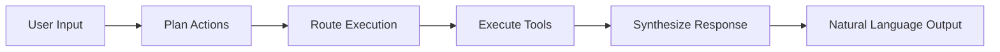

AgenticPal uses advanced natural language processing to understand your requests and execute the appropriate actions. You don't need to memorize commands—just describe what you want in plain English.

## How It Works

AgenticPal employs a multi-stage processing pipeline:



### 1. Plan Actions

The agent analyzes your request to determine:
- Which tools are needed
- What parameters to extract
- Whether confirmation is required
- Dependencies between actions

Implemented in `agent/graph/nodes/plan_actions.py`.

### 2. Route Execution

The system decides how to execute tools:
- **Parallel**: Independent actions run simultaneously
- **Sequential**: Dependent actions run in order
- **Confirmation**: Destructive actions pause for approval

### 3. Execute Tools

Tools are invoked with validated parameters:
- Calendar operations
- Email queries
- Task management

### 4. Synthesize Response

Results are formatted into a natural, human-readable response.

Implemented in `agent/graph/nodes/synthesize_response.py`.

## Natural Language Examples

### Calendar

```python
# Absolute dates
"Add a meeting on March 15th at 2pm"
"Schedule dentist appointment on 3/20/2026 at 10am"

# Relative dates
"Create an event tomorrow at 9am"
"Add a meeting next Tuesday at 2pm"
"Schedule a call in 2 hours"

# Contextual times
"Book lunch tomorrow at noon"
"Set up a meeting this afternoon"
"Add a morning standup every day"

# Duration
"Schedule a 30-minute meeting with John"
"Block 2 hours for deep work tomorrow"
"Add a quick 15-minute sync"
```

### Email

```python
# Simple queries
"Show me my recent emails"
"What's in my inbox?"
"List my unread messages"

# Sender-based
"Find emails from Sarah"
"Show messages from my boss"
"List emails from john@example.com"

# Subject-based
"Search for emails about the project"
"Find messages with 'invoice' in the subject"
"Show me budget-related emails"

# Time-based
"Show emails from this week"
"List messages from yesterday"
"Find emails after March 1st"

# Combined filters
"Show unread emails from Sarah with attachments"
"Find important messages from last week"
```

### Tasks

```python
# Create
"Create a task: buy groceries"
"Add a todo: finish report"
"Remind me to call the dentist"

# With due dates
"Add task 'Submit proposal' due Friday"
"Create a todo: review PR, due tomorrow"
"Remind me to pay rent on the 1st"

# Complete
"Mark 'buy groceries' as done"
"I finished the report"
"Check off the dentist task"

# Update
"Change my task title to 'Buy groceries and supplies'"
"Update the due date to next week"
"Add notes to the project task"
```

## Date & Time Parsing

AgenticPal uses intelligent date/time parsing from `agent/date_utils.py`:

### Relative Dates

**Tomorrow/Today/Yesterday**:
```python
"Add a meeting tomorrow at 2pm"
# Parsed: 2026-03-09T14:00:00
```

**Next/This/Last + Day**:
```python
"Schedule an event next Tuesday"
# Parsed: 2026-03-10T09:00:00 (defaults to 9am if no time)

"Create a task this Friday"
# Parsed: 2026-03-12T00:00:00
```

**In X Time**:
```python
"Add a reminder in 2 hours"
# Calculated from current time: 2026-03-08T16:30:00

"Schedule a meeting in 3 days"
# Parsed: 2026-03-11T09:00:00
```

### Absolute Dates

**ISO Format**:
```python
"2026-03-15T14:00:00"
"2026-03-15"  # Date only, defaults to 9am
```

**Natural Format**:
```python
"March 15th at 2pm"
"3/15/2026 at 2:00 PM"
"March 15, 2026"
```

### Time Parsing

**12-hour Format**:
```python
"2pm", "2:30 PM", "10:15am"
```

**24-hour Format**:
```python
"14:00", "22:30", "09:15"
```

**Contextual**:
```python
"noon" → 12:00 PM
"midnight" → 12:00 AM
"morning" → 9:00 AM
"afternoon" → 2:00 PM
"evening" → 6:00 PM
```

### Duration Parsing

```python
from agent.date_utils import parse_duration

parse_duration("1 hour")     # timedelta(hours=1)
parse_duration("30 minutes") # timedelta(minutes=30)
parse_duration("2h")         # timedelta(hours=2)
parse_duration("1.5 hours")  # timedelta(hours=1.5)
parse_duration("45 min")     # timedelta(minutes=45)
parse_duration("2 days")     # timedelta(days=2)
```

### Implementation

```python
from agent.date_utils import parse_datetime

# Natural language → ISO format
date_str = "next Tuesday at 2pm"
iso_date, is_all_day = parse_datetime(date_str, timezone="UTC")
# Returns: ("2026-03-10T14:00:00", False)

# Date without time
date_str = "March 15th"
iso_date, is_all_day = parse_datetime(date_str, timezone="UTC")
# Returns: ("2026-03-15", True)
```

The parser uses `dateparser` library with smart defaults:
- **Future preference**: "Monday" means next Monday, not last Monday
- **Timezone aware**: Respects specified timezone
- **Context sensitive**: "morning" depends on current time

## Intent Recognition

AgenticPal recognizes user intent across different phrasings:

### Create/Add
```python
"Add a meeting"
"Create an event"
"Schedule a call"
"Set up a reminder"
"Book an appointment"
```

### List/Show
```python
"Show me my tasks"
"List my emails"
"What's on my calendar?"
"Display my schedule"
"What are my todos?"
```

### Update/Modify
```python
"Change the meeting time"
"Update the task title"
"Move the event to Friday"
"Modify the appointment"
"Reschedule the call"
```

### Delete/Remove
```python
"Delete the meeting"
"Remove the task"
"Cancel the appointment"
"Delete the event"
"Remove my reminder"
```

### Complete/Finish
```python
"Mark the task as done"
"I finished the task"
"Complete the todo"
"Check off the task"
"Done with that task"
```

## Tool Discovery

AgenticPal uses a meta-tool architecture for efficient tool discovery:

### Three Meta-Tools

1. **`discover_tools`**: Find tools by category or action
2. **`get_tool_schema`**: Get detailed schema for a specific tool
3. **`invoke_tool`**: Execute a tool with parameters

Defined in `agent/tools/tool_definitions.py`.

### Discovery Process

```python
# User: "Show me my calendar"

# Step 1: Discover relevant tools
meta_tools.discover_tools(category="calendar", action="list")
# Returns: ["list_calendar_events"]

# Step 2: Get tool schema
meta_tools.get_tool_schema(tool_name="list_calendar_events")
# Returns: Full parameter schema

# Step 3: Invoke tool
meta_tools.invoke_tool(
    tool_name="list_calendar_events",
    parameters={"max_results": 10}
)
# Returns: List of calendar events
```

### Tool Categories

- **`calendar`**: Calendar event management
- **`gmail`**: Email operations
- **`tasks`**: Todo list management

### Tool Actions

- **`create`**: Add new items
- **`read`**: Retrieve information
- **`update`**: Modify existing items
- **`delete`**: Remove items
- **`search`**: Find specific items
- **`list`**: View collections

## Prompt Engineering

AgenticPal uses structured prompts to guide the LLM:

### Planning Prompt

From `agent/graph/nodes/plan_actions.py`:

```python
PLAN_ACTIONS_SYSTEM_PROMPT = """
You are an AI assistant that helps users manage their calendar, email, and tasks.

Current date: {current_date}
Current time: {current_time}

You have access to three meta-tools:
1. discover_tools - Find tools by category/action
2. get_tool_schema - Get detailed schema for a tool
3. invoke_tool - Execute a tool with parameters

Use these meta-tools to fulfill the user's request.
"""
```

### Response Synthesis Prompt

From `agent/graph/nodes/synthesize_response.py`:

```python
SYNTHESIZE_RESPONSE_PROMPT = """
You are summarizing the results of tool executions for the user.

Provide a natural, helpful response that:
- Confirms what was done
- Presents results clearly
- Explains any errors
- Suggests next steps if appropriate

Format lists and data nicely for readability.
"""
```

## Context Awareness

The agent maintains conversation context:

```python
# From agent state
conversation_history = state.get("conversation_history", [])

# Recent messages (last 5) are included in prompts
for msg in conversation_history[-5:]:
    if msg.get("role") == "user":
        messages.append(HumanMessage(content=msg["content"]))
    elif msg.get("role") == "assistant":
        messages.append(AIMessage(content=msg["content"]))
```

This enables multi-turn conversations where the agent remembers previous interactions.

## Parameter Extraction

The LLM extracts structured parameters from natural language:

```python
# User: "Add a meeting with John next Tuesday at 2pm for 1 hour"

# Extracted parameters:
{
    "tool_name": "add_calendar_event",
    "parameters": {
        "title": "Meeting with John",
        "start_time": "2026-03-10T14:00:00",
        "end_time": "2026-03-10T15:00:00",
        "attendees": ["john@example.com"],  # If email known
        "timezone": "UTC"
    }
}
```

Pydantic schemas ensure type safety and validation.

## Error Recovery

When the agent encounters ambiguity or errors, it asks clarifying questions:

```python
User: "Add a meeting with John"
Agent: "I'd be happy to schedule that. When would you like to meet with John?"

User: "Tomorrow at 2pm"
Agent: "Meeting with John scheduled for March 9th at 2:00 PM."
```

See [Multi-turn Conversations](/features/multi-turn-conversations) for details.

## Next Steps

<CardGroup cols={2}>
  <Card title="Multi-turn Conversations" icon="messages" href="/features/multi-turn-conversations">
    Learn about context-aware interactions
  </Card>
  <Card title="Confirmations" icon="shield-check" href="/features/confirmations">
    Understand confirmation flows
  </Card>
</CardGroup>