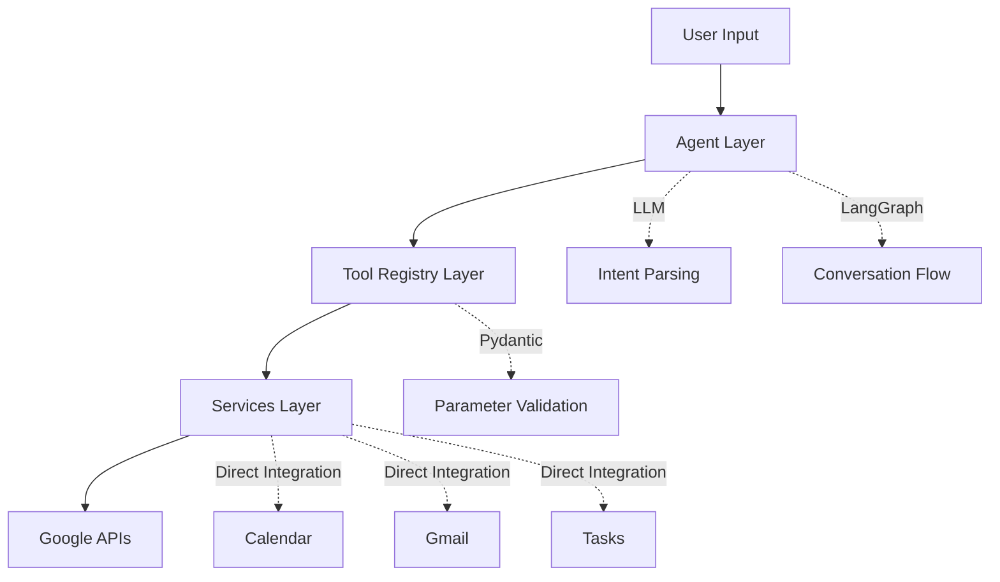

## What is AgenticPal?

AgenticPal is an intelligent personal assistant that makes managing your Google Workspace productivity apps effortless. Describe what you need in plain English, and AgenticPal handles the rest—from scheduling meetings to summarizing emails and organizing tasks.

## Key Features

<CardGroup cols={2}>
  <Card title="Natural Language Interface" icon="message">
    Just describe what you need: "Add a meeting with John next Tuesday at 2pm" or "Summarize my emails from this week"
  </Card>
  <Card title="Multi-Service Integration" icon="grid">
    Seamless access to Google Calendar, Gmail, and Tasks through a unified conversational interface
  </Card>
  <Card title="Intelligent Context" icon="brain">
    Multi-turn conversations with clarifying questions. The agent remembers context and asks when it needs more information
  </Card>
  <Card title="Safety First" icon="shield-check">
    Confirmation prompts for destructive operations like deleting events or tasks keep your data safe
  </Card>
</CardGroup>

## What Can You Do?

### Calendar Management
- Create, update, and delete calendar events
- Search for events by title or time range
- List your upcoming schedule
- Add attendees and descriptions to meetings

### Email Operations
- Read and search emails with Gmail syntax
- Get detailed email content
- Summarize emails from specific time periods
- List unread messages

### Task Management
- Create and organize tasks
- Mark tasks as complete or incomplete
- Update task details and due dates
- Manage multiple task lists

## Architecture

AgenticPal uses a three-layer architecture for clean separation of concerns:



<Steps>
  <Step title="Agent Layer">
    High-level orchestration using LLM for intent parsing, action planning, and natural language understanding
  </Step>
  <Step title="Tool Registry Layer">
    Pydantic-based validation and standardized tool execution with automatic schema generation
  </Step>
  <Step title="Services Layer">
    Direct Google API integration with error handling and response formatting
  </Step>
</Steps>

## Execution Flow

When you send a request, AgenticPal follows this workflow:

```python
# Internal flow (simplified)
classify_intent
    ↓
plan_actions
    ↓
route_execution
    ↓
[confirm_actions] → execute_sequential / execute_parallel
    ↓
synthesize_response
```

<Note>
  **Smart Routing**: The agent automatically determines whether actions can be executed in parallel or must run sequentially based on dependencies.
</Note>

## Use Cases

<Accordion title="Busy Professional">
  "Schedule a 30-minute standup with the engineering team every Monday at 9am"
  
  AgenticPal parses the natural language request, extracts the time parameters, and creates a recurring calendar event with attendees.
</Accordion>

<Accordion title="Email Management">
  "Show me unread emails from my boss about the Q1 report"
  
  Combines Gmail search filters and natural language understanding to surface exactly what you need.
</Accordion>

<Accordion title="Task Organization">
  "Create a task: Review pull requests, due tomorrow at 5pm"
  
  Intelligently parses relative dates like "tomorrow" and creates the task with the correct due date.
</Accordion>

## Technology Stack

AgenticPal is built with modern Python tools and frameworks:

- **LangGraph 0.2+**: Stateful agent orchestration with conversation memory
- **LangChain**: LLM integration and tool calling
- **Pydantic 2.0**: Schema validation and type safety
- **FastAPI**: High-performance web API with async support
- **Google API Client**: Direct integration with Calendar, Gmail, and Tasks
- **Redis**: Session management and conversation persistence

<Info>
  AgenticPal uses the **qwen-plus** model by default but is designed to work with any LLM that supports tool calling.
</Info>

## Deployment Options

<CardGroup cols={2}>
  <Card title="CLI Interface" icon="terminal">
    Run locally with an interactive command-line REPL for quick access
  </Card>
  <Card title="Web API" icon="cloud">
    Deploy as a FastAPI service with REST endpoints and real-time streaming via Server-Sent Events
  </Card>
</CardGroup>

## What's Next?

<Card title="Get Started" icon="rocket" href="/quickstart">
  Follow our quickstart guide to get AgenticPal running in minutes
</Card>